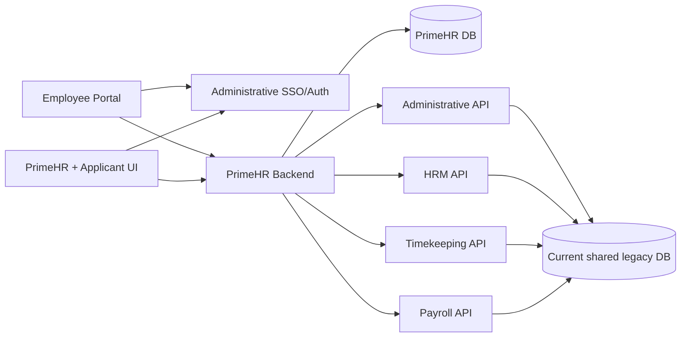

# ISOFT PRIME-HRM Phase 0 Architecture Discovery

Status: Complete  
Date: 2026-08-02  
Source: `C:\Users\javin\.codex\ISOFT_PRIME_HRM_CODEX_MASTER_PLAN_V2.md` v2.0  
Scope: Architecture discovery only. No table, API, UI, or deployment implementation.

## Executive decision

Build ISOFT PRIME-HRM as one modular Spring Boot backend with six internal domain boundaries, not six initial microservices. Place it as a future `PrimeHR` Maven module in the existing `hris` reactor, but run it standalone first against a PrimeHR-owned physical database. Create one future management frontend, `prime-hr-software`; retain `employee-portal-UI` for employee self-service; initially host public applicant routes in the PrimeHR frontend behind a separate applicant identity boundary.

Use versioned synchronous REST contracts first. RabbitMQ, an outbox, analytics read models, a gateway, and object storage are deferred until a concrete workflow requires them.

## Discovery boundary

The checked-out code, configuration, tests, reports, and Git state were inspected for:

- `hris`
- `administrative-software`
- `hr-management-UI`
- `time-keeping-software`
- `payroll-ui`
- `employee-portal-UI`

No project-level `AGENTS.md` or `AGENTS.override.md` was found. The global ISOFT HRIS guidance and Master Plan V2 governed discovery. Secret values found in tracked code/configuration are deliberately not reproduced here.

## Actual repository and deployable map

### Backend

The backend is one Maven multi-module Git repository.

| Module | Package | Standalone | Current ownership | Inventory |
|---|---|---:|---|---:|
| `Common` | `com.hris.common` | No | JWT/shared utilities and runtime support | 8 Java |
| `Administrative` | `com.administrative` | Yes | masters, settings, permissions, SSO | 203 Java; 33 controllers/entities |
| `HumanResource` | `com.humanresource` | Yes | employees, PDS, appointments, leave, HR reports | 163 Java; 25 controllers; 23 entities; 16 JRXML |
| `TimeKeeping` | `com.timekeeping` | Yes | schedules, raw logs, DTR and reports | 28 Java; 4 controllers/entities; 2 JRXML |
| `Payroll` | `com.payroll` | Yes | payroll calculation/results/reports | 93 Java; 12 controllers; 8 JRXML |
| `EmployeePortal` | `com.emloyeeportal` | Yes | minimal backend bootstrap/auth | 2 Java |
| `HRISApp` | `com.hris` | Yes | combined application assembling all modules | 2 Java |

`HRISApp` depends on every module, component-scans their packages, and substitutes a combined security configuration. The root Dockerfile packages HRISApp for cloud use. There is no API gateway, service discovery, broker, outbox, object-store abstraction, or separate reporting service.

Checked-in standalone ports are Administrative `8082`, Timekeeping `8083`, HRM `8085`, Payroll `8087`, and HRISApp `${PORT:9090}`. These are configurable defaults, not contracts.

### Frontends

| Repository | Route owner |
|---|---|
| `administrative-software` | `/administrative`; permissions, system configuration, SSO authority |
| `hr-management-UI` | `/hr-management`; core HR |
| `time-keeping-software` | `/time-keeping`; timekeeping |
| `payroll-ui` | `/payroll-management`; payroll |
| `employee-portal-UI` | `/employee-portal`; employee self-service and module launcher |

All are separate Git repositories using App Router, React 18, strict TypeScript, SCSS modules, and SweetAlert2. They currently declare Next.js `^16.2.6`, correcting the plan's Next.js 15 assumption. No PrimeHR repository or route exists.

### Current database topology — material correction

The existing domains are logically separated but are not physically database-isolated:

- standalone Administrative, HRM, Timekeeping, and Payroll currently target the same local SQL Server database;
- cloud HRISApp uses one PostgreSQL datasource/persistence unit for all assembled entities;
- some cross-module configuration reads use `JdbcTemplate` directly against `system_config`;
- schema management largely uses `ddl-auto=update`;
- no Flyway or Liquibase configuration exists.

PrimeHR must not copy this shared-database coupling. It owns its database and integrates only through contracts.

## Validated target architecture



Confirmed:

- PrimeHR internally owns Competency, Learning, Performance, Recruitment, Rewards, and Succession.
- Administrative owns SSO, permissions, system configuration, and existing organization/job/plantilla masters.
- HRM owns employee, PDS, appointment, and employment history.
- Timekeeping owns schedules/finalized attendance; Payroll owns finalized payroll.
- PrimeHR never queries or joins another domain's tables.
- New PrimeHR reports remain in PrimeHR; a separate Reporting Service is unjustified now.

Corrections:

1. The plan's database-per-service picture is a target boundary, not current reality.
2. There is no gateway; Phase 1 should use configurable URLs and current SSO rather than create one.
3. There is no broker; RabbitMQ is not a Phase 1 prerequisite.
4. `SystemConfigRuntimeResolver` directly reads Administrative storage and is invalid for isolated PrimeHR. Use the Administrative API with environment/bootstrap fallback.
5. Current frontend permission checks do not constitute backend authorization.
6. Existing organization structure is Area → Business Unit, not an arbitrary hierarchy.
7. Existing Job Position/Plantilla do not model complete Qualification Standards or vacancy state.

## Backend placement and structure

Create `PrimeHR` as a sibling module in `hris`. Recommended root package is `com.primehr`, matching existing `com.<domain>` conventions. Internally enforce domain boundaries:

```text
PrimeHR/src/main/java/com/primehr/
  PrimeHRApplication.java
  config/ security/ shared/
  integration/{administrative,humanresource,timekeeping,payroll}/
  competency/{api,application,domain,infrastructure}/
  learning/{api,application,domain,infrastructure}/
  performance/{api,application,domain,infrastructure}/
  recruitment/{api,application,domain,infrastructure}/
  rewards/{api,application,domain,infrastructure}/
  succession/{api,application,domain,infrastructure}/
PrimeHR/src/main/resources/
  application{-postgresql,-sqlserver}.properties
  db/migration/{postgresql,sqlserver}/
  reports/
```

One domain calls another's application interface, never its repository.

### Standalone and combined deployment

Standalone PrimeHR is the safe first runtime: own datasource/entity scan/transaction manager, configurable service URLs, shared JWT contract, configurable non-conflicting port (current defaults leave `8086` available).

Adding `PrimeHR` directly as an HRISApp dependency would bind its entities to the legacy datasource. Therefore do not add it to combined runtime until tests prove:

- a named `primeHrDataSource`;
- isolated entity manager/repository scan/transaction manager;
- no transaction spanning legacy and PrimeHR databases;
- explicit startup failure if combined PrimeHR is enabled without its datasource.

It may join the Maven reactor in Phase 1 without joining HRISApp runtime. Deploy it separately on Render/on-premise until isolation is proven.

## Frontend and applicant placement

Create `prime-hr-software` later with routes:

```text
/prime-hrm
/prime-hrm/{competencies,learning,performance,recruitment,rewards,succession}
/apply
/apply/vacancies/[id]
/apply/account/*
```

Public applicant pages may share the Next.js deployment initially but require a separate layout, API client, session storage, token type/audience, and endpoint namespace. An applicant token must never authorize employee/HR APIs.

Future Employee Portal ownership:

```text
/employee-portal/prime-hrm/my-profile
/employee-portal/prime-hrm/my-learning
/employee-portal/prime-hrm/my-performance
/employee-portal/prime-hrm/my-recognition
/employee-portal/prime-hrm/my-career
```

Add routes only with backing contracts; early phases can launch PrimeHR through the existing one-time SSO ticket flow.

Reuse existing App Router/SCSS/sidebar/table/modal conventions, `fetchWithAuth`, runtime config priority, SSO bootstrap, SweetAlert2, and exact CRUD permission helpers. These helpers are duplicated across repos; extraction into a shared package is deferred to avoid expanding Phase 1.

## Data ownership

| Data | Authority | PrimeHR treatment |
|---|---|---|
| employee/PDS/education/eligibility/history | HRM | versioned API read; source ID and transaction snapshot only |
| appointment/active position/plantilla assignment | HRM | API read and historical snapshot |
| Area, Business Unit, job and plantilla masters | Administrative | referenced, never duplicated as editable masters |
| supervisor/head | unresolved; `ManagePersonnel`/approval workflow are partial | require an explicit owning contract |
| permissions, SSO, runtime URLs | Administrative | API/SSO; short cache; fail closed for commands |
| schedule/final attendance | Timekeeping | later finalized summaries only |
| final payroll results | Payroll | later approved aggregates only |
| competencies, learning, performance, recruitment, rewards, succession | PrimeHR | owned, audited and versioned |

PDS learning history is employee evidence, not a replacement for PrimeHR's program, offering, nomination, attendance, evaluation, and completion transactions.

## Integration and synchronization

Use synchronous REST initially with `/api/primehr/v1/...`, typed DTOs/OpenAPI, timeouts, bounded retries for safe reads, correlation IDs, and actionable dependency errors.

| Consumer → provider | Contract | Timing |
|---|---|---|
| PrimeHR → Administrative | SSO, authorization, config, organization references | immediate |
| PrimeHR → HRM | employee summary, active appointment, qualification summary | immediate as required |
| PrimeHR → Timekeeping | finalized attendance summary | deferred |
| PrimeHR → Payroll | finalized payroll aggregate | deferred |
| Employee Portal → PrimeHR | employee self-service views | per domain phase |
| HRM ← PrimeHR | approved applicant handoff | recruitment phase |

Candidate events, all deferred until transport/operations are approved: `EmployeeProfileChanged`, `AppointmentChanged`, `OrganizationReferenceChanged`, `PermissionRulesetChanged`, `AttendancePeriodFinalized`, `PayrollPeriodFinalized`, `CompetencyProfileActivated`, `LearningCompletionRecorded`, `PerformanceReviewFinalized`, `ApplicantHandoffApproved`, `RecognitionGranted`, and `SuccessionPlanActivated`.

The first event implementation must include owner-side outbox, event ID, aggregate version, occurred-at timestamp, idempotent consumer, replay, and dead-letter/reconciliation rules.

## Snapshot, versioning, and stale-data policy

- Competencies, profiles, rating scales, templates, workflows, and policies are versioned aggregates.
- Drafts are mutable with optimistic locking; active/published versions are immutable.
- Completed transactions keep the exact definition/profile/policy/workflow version.
- Audits record actor, timestamp, old/new state, reason, correlation, and version.
- Historical records store source IDs plus material employee/position/organization snapshots.
- Snapshots are evidence, not editable duplicate masters.
- Cached references include `sourceVersion`/`sourceUpdatedAt` and `fetchedAt`.
- Commands fail with a retryable dependency error when current authorization/appointment facts cannot be verified.
- History may show last-known facts with an explicit stale warning.
- Reconciliation reports drift but never overwrites historical snapshots.

## SQL Server/PostgreSQL portability

Use Flyway for PrimeHR, `ddl-auto=validate`, and equivalent provider locations:

```text
db/migration/postgresql/
db/migration/sqlserver/
```

Select by profile. Define all constraints, indexes, uniqueness, lengths, numeric scale, and timestamp precision. Keep identity/boolean differences in migrations. Use `BigDecimal` for scores, `Instant` for audit timestamps, and `LocalDate` for effective dates. Prefer JPA/JPQL/derived pageable queries and isolate unavoidable native SQL by provider.

Test migrations and repositories against real PostgreSQL and SQL Server. H2 is useful but not portability evidence. No Testcontainers dual-provider suite exists currently; Phase 1 must establish one or document managed test database constraints. SQL Server container CI also needs explicit license acceptance.

Production rollback uses forward corrective migrations, never destructive automatic rollback or `ddl-auto=update`.

## Security model

Employee/HR users retain Administrative-issued JWT/SSO. Applicants use a separate identity/token boundary. Future service synchronization uses service identity rather than browser tokens.

Authorization is the intersection of:

1. module access;
2. action (`access`, CRUD, `submit`, `review`, `recommend`, `approve`, `finalize`, `publish`, `export`);
3. data scope (self, reports, assigned organization, assigned panel, organization-wide);
4. process role;
5. workflow/resource state.

Backend services enforce every mutation and scoped read. UI hiding is usability only. Preserve and centralize established admin/super-admin behavior, including role string `"1"`, while auditing privileged actions.

Current production-readiness gaps: JWTs lack detailed scopes; permission JSON centers on CRUD; broad backend action enforcement is absent; bootstrap endpoints are broadly reachable; tracked source/config includes secret material; CORS/URLs are partially hardcoded. PrimeHR must not reproduce these gaps. Externalize and rotate secrets separately; never put values in documentation/migrations.

## File storage, reporting, workflow

No general secure storage abstraction exists. When a phase needs evidence files, define `DocumentStorage` with DB metadata/checksum/classification/retention, secure local on-premise implementation, S3-compatible cloud implementation, validation/scanning hooks, and per-download authorization. Competency Phase 1 needs no file storage.

PrimeHR owns its operational reports. Prefer service DTOs and `JRBeanCollectionDataSource`; package Jasper resources; never use cross-DB SQL joins; enforce screen-equivalent data scopes; use the same application queries for UI and exports. A warehouse/read model remains deferred until measured need.

Existing `ApprovalWorkflow` is request-specific, not a universal PrimeHR engine. PrimeHR later owns versioned definitions and immutable instances with explicit transitions, assignments, separation of duties, idempotency, and append-only decision audit.

## Existing assets to reuse carefully

Reuse:

- Java 17 Maven reactor/wrapper;
- existing layering and typed DTO patterns;
- shared JWT/filter concepts after configuration cleanup;
- one-time SSO ticket hashing, expiry, consumption, and session-version logic;
- Administrative SystemConfig API and permission integration point;
- HRM employee/appointment services as source contracts;
- portable Jasper classpath/font, data-loader, and PDF smoke-test patterns;
- frontend runtime config, SSO, SCSS, table/modal, and notification patterns.

Do not reuse as-is:

- direct cross-domain `JdbcTemplate` reads;
- broad authentication as complete authorization;
- hardcoded secrets/origins/URLs/ports;
- `ddl-auto=update`;
- generic exception/entity API exposure;
- frontend-only authorization;
- cross-domain SQL/JRXML joins;
- copied employee/PDS tables;
- `ManagePersonnel` as a complete hierarchy;
- PDS history as the L&D transaction model.

## Required future contract additions

Administrative: register `primehr` SSO target; add `api.url.primehr`/`ui.url.primehr`; extend module/action/data-scope/process-role permission configuration; publish versioned organization/job/plantilla/authorization DTOs; identify supervisor authority.

HRM: publish minimal employee qualification/active appointment DTOs with source version metadata; later accept approved recruitment handoff idempotently.

Timekeeping/Payroll: no Phase 1 change; later publish finalized aggregates only for approved requirements.

Employee Portal: add launch/module key only when SSO and authorization exist; add feature routes with their APIs.

## Risks and open decisions

| Risk/open item | Severity/decision |
|---|---|
| HRISApp silently binds PrimeHR to legacy datasource | Critical — standalone first; tested isolated persistence before combined mode |
| tracked/hardcoded secret material | Critical — externalize and rotate; never copy |
| frontend permissions mistaken for authorization | Critical — backend action/scope/state enforcement |
| no migrations or dual-provider harness | High — Flyway and real-provider tests from first schema |
| supervisor authority undefined | Decide Administrative versus HRM before performance workflows |
| complete Qualification Standards ownership undefined | Decide Administrative master expansion versus PrimeHR versioned profile before recruitment |
| applicant and employee identities conflated | High — separate issuer/audience/session/API namespace |
| stale reference facts affect decisions | High — versions, freshness gates, snapshots, reconciliation |
| duplicated frontend helpers drift | Medium — defer shared-package extraction |
| Phase 1 says read-only but acceptance says draft CRUD | Decide before Phase 1; recommendation below |
| storage provider and legal retention | Decide before first document-bearing phase |
| SQL Server CI mechanism/license | Decide before Phase 1 acceptance |

## Smallest safe Phase 1

The plan conflicts between a read-only Phase 1 and draft CRUD acceptance. Recommend a foundation slice first:

- scaffold standalone `PrimeHR` and isolated profiles;
- add Flyway schemas for versioned competency definitions/profiles only;
- add read-only paginated list/detail APIs using controlled non-production fixtures;
- enforce backend `access` plus admin/super-admin compatibility;
- integrate Administrative config/auth and HRM summary through APIs;
- scaffold `prime-hr-software` competency list/detail;
- add SSO/module link only after both deployables exist;
- add unit, authorization, contract, and dual-provider migration/repository tests;
- document OpenAPI and operations.

Excluded: publishing, assessments/gap analysis, workflow, notification, files, broker/outbox, analytics, other five domains, and combined HRISApp mode without persistence proof. If draft CRUD is explicitly required, add audited optimistic-locked draft commands only; active versions stay immutable.

### Likely Phase 1 files

```text
hris/pom.xml
hris/PrimeHR/pom.xml
hris/PrimeHR/src/main/java/com/primehr/PrimeHRApplication.java
hris/PrimeHR/src/main/java/com/primehr/{config,security,shared,integration}/**
hris/PrimeHR/src/main/java/com/primehr/competency/{api,application,domain,infrastructure}/**
hris/PrimeHR/src/main/resources/application*.properties
hris/PrimeHR/src/main/resources/db/migration/{postgresql,sqlserver}/V1__competency_foundation.sql
hris/PrimeHR/src/test/java/com/primehr/**
hris/contracts/openapi/primehr-v1.yaml
hris/Administrative/src/main/java/com/administrative/sso/SsoTarget.java
administrative-software/... permission/runtime-config/SSO integration files
employee-portal-UI/src/components/sidebar/Sidebar.tsx
employee-portal-UI/... runtime-config/SSO integration files
prime-hr-software/package.json and Next.js application shell
prime-hr-software/src/app/prime-hrm/competencies/{page.tsx,[id]/page.tsx}
```

Exact paths must be reconfirmed immediately before implementation.

### Phase 1 acceptance

- standalone PrimeHR starts without legacy-table access;
- equivalent constrained migrations and `ddl-auto=validate` pass on PostgreSQL and SQL Server;
- typed/versioned/paginated competency APIs and OpenAPI agree;
- unauthenticated, unauthorized, stale-auth, and dependency failures are tested;
- admin/super-admin compatibility is preserved and audited;
- frontend lint, strict types, tests where available, and production build pass;
- loading/empty/unauthorized/server-error UI states exist;
- one-time SSO is retained and no credentials/local paths/vendor-specific shared SQL are introduced;
- affected existing builds/tests pass;
- combined mode remains disabled if datasource isolation lacks test evidence;
- progress ledger is updated.

## Phase 0 stop confirmation

Phase 0 creates only this document and `PRIME_HRM_PROGRESS.md`. It creates no PrimeHR module, table, migration, entity, repository, endpoint, SSO target, permission, frontend repository, route, page, report, or deployment change.
